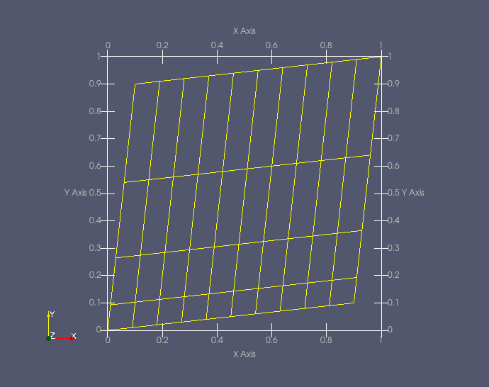

= Grid elements

== StructuredGrid
The constructor for a structured-grid object accepts all of its arguments via keywords.
For example:
----
from gdtk.geom.vector3 import Vector3
from gdtk.geom.surface import CoonsPatch
from gdtk.geom.sgrid import StructuredGrid
from gdtk.geom.cluster import RobertsFunction

my_patch = CoonsPatch(p01=Vector3(0.1, 0.9), p11=Vector3(1.0, 1.0),
                      p00=Vector3(0.0, 0.0), p10=Vector3(0.9, 0.1))

cf_y = RobertsFunction(True, False, 1.1)
g = StructuredGrid(psurf=my_patch, niv=11, njv=5,
                   cf_list=[None, cf_y, None, cf_y])

g.write_to_vtk_file("my_grid.vtk")
----

