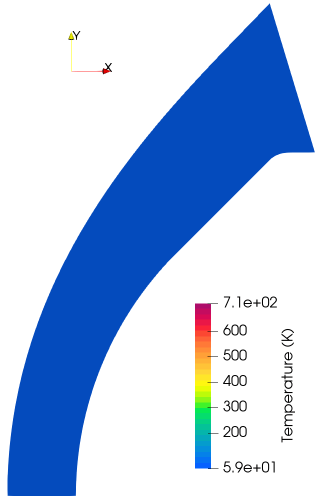

//tag::description[]
= Phoebus capsule simulation
`gdtk/examples/lmr/2D/capsule-phoebus`

Reece B. Otto; Robert Watt
2025-02-06

This example simulates low-enthalpy flow over a sub-scale model of the
Phoebus reentry capsule. The free-stream properties are based on the P20 
conditions from Bianchi et. al.:
[stem]
++++
u_{\infty} = 927 ~~ m/s; \quad T_{\infty} = 59.4 ~~ K; \quad p_{\infty} = 1.30 ~~ kPa
++++
[stem]

[TIP]
====
This example demonstrates how to:

. Use the shock-fitting capability for the steady-state solver
. Use a `ControlPointPatch` and manipulate some control points for fine-tuning of the grid
====

//end::description[]

== Reference

    @article{Bianchi2021,
        title = {Numerical Analysis and Wind Tunnel Validation of Low-Temperature Ablators undergoing Shape Change},
        journal = {International Journal of Heat and Mass Transfer},
        volume = {177},
        pages = {121430},
        year = {2021},
        issn = {0017-9310},
        doi = {10.1016/j.ijheatmasstransfer.2021.121430},
        author = {Bianchi, D. and Migliorino, M. T. and Rotondi, M. and Turchi, A.}
    }
