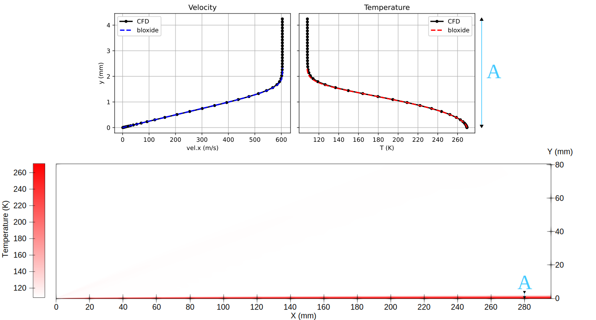

//tag::description[]
= Laminar supersonic boundary layer at Mach 2.9
`gdtk/examples/lmr/2D/laminar-flat-plate`

Nick N. Gibbons
2025-09-17

This example is a laminar flat plate at Mach 2.9, based on the condition in
Poggie et al. 2014. The goal here is to compare to an analytic solution, a
compressible self-similar boundary layer profile computed by `bloxide`, which
is available https://github.com/uqngibbo/bloxide[*here*]. This example is
intentionally underresolved for the purposes of running the automated tests, but
still gives reasonable agreement with the analytic solution.

Note that this ideal-air.lua gas model specifies a constant Prandtl number,
which is typical for self-similar calculations. For a more realistic situation,
you probably don't want this, since it gives a kind of inaccurate heat transfer.

//end::description[]
:stem:

== Reference
  @inproceedings{poggie_iles14,
    title={Implicit Large-Eddy Simulation of a Supersonic Turbulent Boundary Layer: Code Comparison},
    author={Jonathan Poggie and Nicholas J. Bisek and Tmiothy Leger and Ricky Tang},
    booktitle={52nd Aerospace Sciences Meeting},
    year={2014},
    address={National Harbor, Maryland}
  }

