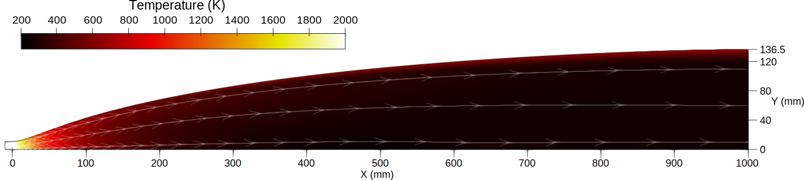
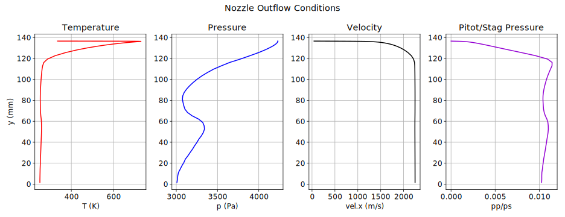
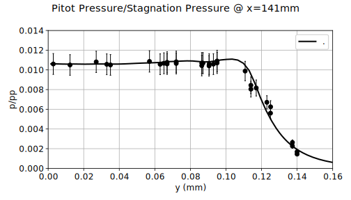
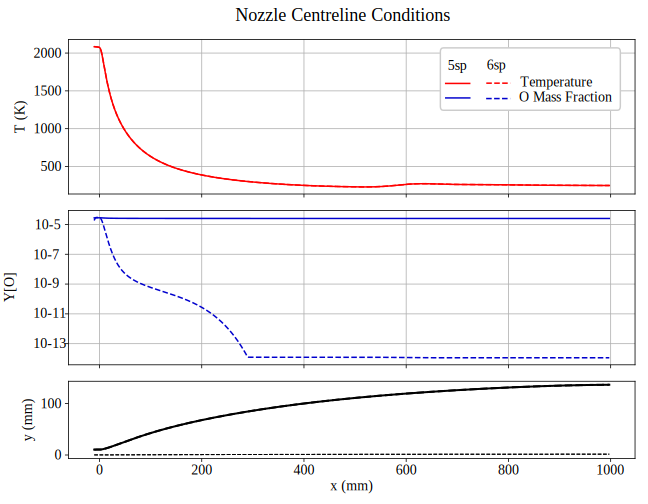

//tag::description[]
= Supersonic flow in the nozzle of a reflected shock tunnel 
`gdtk/examples/lmr/2D/shock-tunnel-nozzles`

Nick N. Gibbons
2026-05-29

This directory collects some example simulations of 2D, axisymmetric, de Laval nozzles that are used in hypersonic test facilities such as reflected shock tunnels. These facilities use nozzles to expand a reservior of high pressure, high temperature gas to produce a supersonic test flow that can pass over an experiment. In these examples we consider contoured nozzles, which are designed to produce a region of of uniform-ish core flow that mimics the conditions encountered in supersonic flight. They may be helpful for you in predicting the size of this core flow, or for computing the amount of core nonunformity, however if you merely need an estimate of the test flow conditions, we recommend faster tools such as nenzf1d or ESTCn.

An example calculation, using the Mach 7 nozzle from the T4 shock tunnel, is depicted below.

//end::description[]
:stem:

== Getting started with a non-reacting example
The simplest example to get started with is the one labeled `therm-perf-air`. This considers a single species, non-reacting, thermally perfect gas with inputs designed to match a specific T4 experiment. These inputs are the shock speed and other parameters measured during the test.

To begin with, the job script performs a sequence of state-to-state calculations that mimic a tunnel postprocessing tool such as ESTCn, to get the flow state at the throat of the converging-diverging nozzle. The actual CFD calculation then considers only the diverging section. We have found that this arrangement to be an expedient and quite accurate way to compute shock tunnel test flows.

The Mach 7 nozzle in T4 is large and the boundary layer inside it is believed to be mostly turbulent. This example uses the Spalart-Allmaras-Edwards turbulence model for the sake of saving time and trouble, but the example `therm-perf-air-komega` has also been added for this who wish to compare to older nozzle simulations.

== Validation against experimental data

The example labelled `with-test-section` extends the computational grid into an open vacuum chamber where the test article would be. This may be helpful for calculating the shape of the core flow cone, which shrinks as it progresses downstream, but it also allows us to validate the solution against the pitot rake data taken from Chan et al. [1]. In the figure below, the both the calculation and the measurmeents has been normalised by the measured stagnation pressure, and show quite good agreement, particularly outside the core flow region where the nozzle boundary layer is affecting the expansion into vacuum.

."]

== Reacting Flows

When simulating a high enthalpy test condition, chemistry in the air mixture can be important. The examples include two reacting flow cases, `five-species-air` and `six-species-air`. Historically, five species have often been used to simulate impulse facilities, however Vanyai and Gibbons [2] have recently found that this approach overestimates the amount of O radicals making their way into the test section. This over-estimation can be a problem when analysing a combustion experiment, since O radials significantly speed up the ignition of most fuels, and a CFD calculation that uses the five species nozzle flow can predict combustion prematurely compared to an experiment. For this reason we have included an example which uses a six species air model, which should be preferred when analysing combustion experiments. 

These two cases give remarkably similar answers, except for the mass fractions of O, which are significantly different.

."]

== Reference
   @article{chan_nozzles18,
     author = {Chan, Wilson Y. K. and Jacobs, Peter A. and Smart, Michael K. and Grieve, Samuel and Craddock, Christopher S. and Doherty, Luke J.},
     title = {Aerodynamic Design of Nozzles with Uniform Outflow for Hypervelocity Ground-Test Facilities},
     journal = {Journal of Propulsion and Power},
     volume = {34},
     number = {6},
     pages = {1467-1478},
     year = {2018},
     doi = {10.2514/1.B36938},
   }
  @techreport{chan_mach7_design13,
    title={Flowpath design of an axisymmetric Mach 7.0 nozzle for T4},
    author={W. Y. K. Chan and M. K. Smart and P. A. Jacobs},
    institution={School of Mechanial and Mining Engineering, The University of Queensland},
    number={2013/01},
    year={2013}
  }
  @techreport{chan_mach7_report14,
    title={Experimental validation of the T4 Mach 7.0 nozzle},
    author={W. Y. K. Chan and M. K. Smart and P. A. Jacobs},
    institution={School of Mechanial and Mining Engineering, The University of Queensland},
    number={2014/14},
    year={2014}
  }
  @article{vanyai_no225,
    title={The overestimation of O radicals in shock tunnel test flows and its effect
on supersonic combustion},
    author={Tritan Vanyai and Nicholas N. Gibbons},
    journal={Aerospace Science and Technology},
    volume={164},
    number={110422},
    year={2025}
  }

