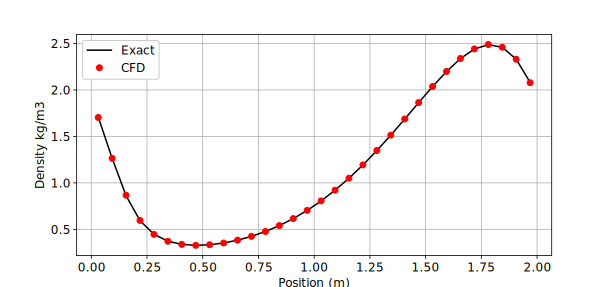
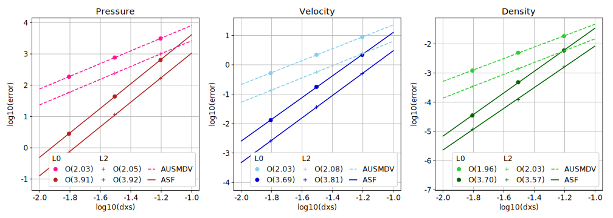

//tag::description[]
= Steepening Wave Problem in 1D
`gdtk/examples/lmr/2D/steepening-wave`

Nick N. Gibbons and Lachlan Whyborn and Daryl Bond,
2024-12-18

This example is a so-called Simple Wave from "Fluid Mechanics", by L. D. Landau
and E. M. Lifshitz. Essentially we begin with a velocity field in a sine wave,
which steepens over time until the forward wave becomes a shock. Up until this
point, an analytic solution is available to compare against.

We use this to exercise the Alpha-Split Flux implementation by Lachlan Whyborn,
which is a compact high order, low dissiapation method, suitable for acoustics
work and LES/DNS. The test script for this example checks the error compared to
the analytic solution, and ensure its order of convergence is around 4.

//end::description[]
:stem:

This figure shows the density of the field, at halfway through its evolution until the shock forms. Since the ASF scheme is unstable near discontinuitites, the solver is stopped at this point. By extracting the L0 and L2 norms of the error from multiple simulations, we can check the order of convergence, as in the following figure.

== Reference
  @inproceedings{gibbons_mldns24,
    title={Direct Numerical Simulation of Supersonic Reacting Mixing Layers},
    author={Nicholas N. Gibbons and Lachlan Whyborn and Vincent Wheatley},
    booktitle={3rd International Conference on High-Speed Vehicle Science and Technology},
    number = {HiSST-2024-159},
    year={2024}
  }

