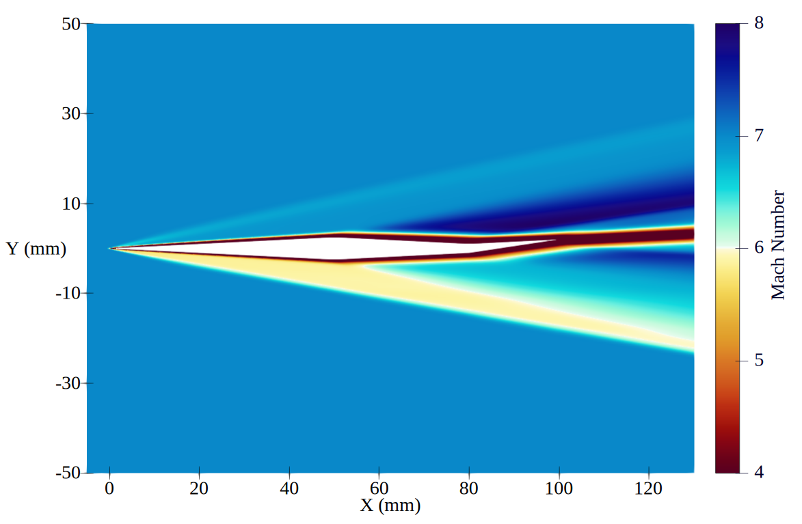

//tag::description[]
= Supersonic turbulent flow over a diamond shaped aerofoil
`gdtk/examples/lmr/2D/supersonic-aerofoil`

Nick N. Gibbons and Brittny Dunn
2024-06-25

This example is a turbulent, supersonic flow over a diamond shaped aerofoil
with a small tail flap. It was used for developing surrogate models 
for aerodynamic databases, and may be helpful for simulating turbulent
aerodynamics over moderately complicated geometries.

//end::description[]
