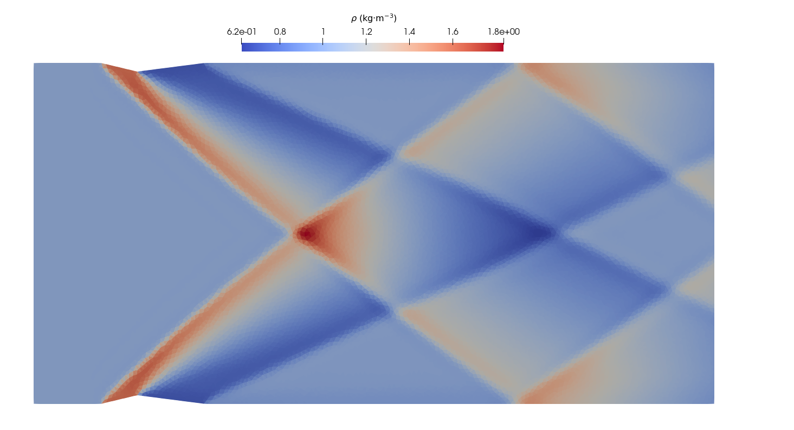

//tag::description[]
= Supersonic flow through a duct with triangular bumps
`gdtk/examples/lmr/2D/supersonic-duct`

Kyle A. Damm
2024-08-21

This example is of supersonic flow through a duct with triangular bumps.
This test case has been taken from the paper by Nishikawa (2022).
The duct has been discretised by a grid of unstructured triangular elements.
The example was set up with the following conditions:
[stem]
++++
M_{\infty} = 2.0; \quad \rho_{\infty} = 1.0 ~~ kg\cdot m^{-3};  \quad T_{\infty} = 300.0 ~~ K; \quad \gamma = 1.4
++++

//end::description[]

== Reference

@inproceedings{nishikawa_2022,
    title={New Unstructured-Grid Limiter Functions},
    author={Nishikawa, Hiroaki},
    booktitle={AIAA SciTech Forum},
    number={2022-1374},
    year={2022}
}
