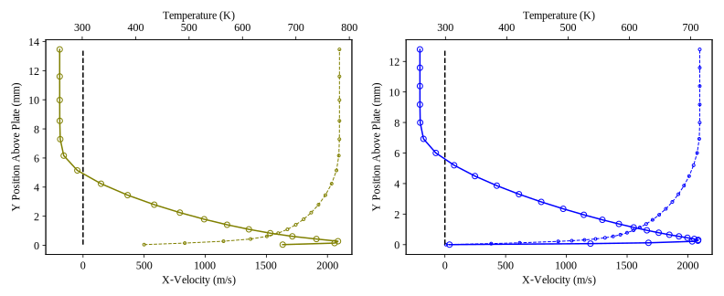
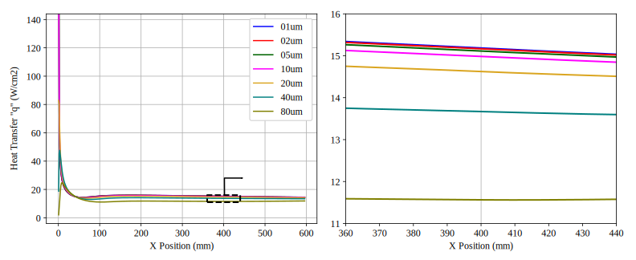

//tag::description[]
= Supersonic turbulent flow over a flat plate
`gdtk/examples/lmr/2D/turbulent-flat-plate`

Nick N. Gibbons
2024-02-26

This example is a turbulent, supersonic flow over a flat plate at Mach 6.5,
from Ye and Morgan (1994). In T4, the boundary layer at this condition is
actually transitional, though here it is treated as fully turbulent from the
leading edge. Both structured and unstructured variants are available, and
the one equation "Edwards" variant of the Spalart-Allmaras turbulence model
is used.

//end::description[]
:stem:

image::figures/pmap.svg[width=100%,opts=inline,title="Pressure and turbulent viscosity color maps for the Mach 6.5 flat plate."]

The tests for this example have been configured to run multiple copies of the flow with different resolutions. Specifically, the clustering to the viscous wall is changed while the rest of the grid is held constant. This allows us to test the rate of convergence of the numerics. Clustering affects the solution A LOT. The figure below shows a slice through the boundary layer at x=400mm, for the coarsest (80 micron first cell height) and finest (1.25 micron first cell height). Note that in both cases the wall is set to 300K and no slip, but the coarse grid's first cell only manages to get down 500 m/s in the velocity and a wildly inaccurate 1600 K in the temperature.

These differences in the boundary layer affect the predictions of heat transfer (q) to the wall. The below figure shows the convergence of the wall heat transfer as the grid is refined, focusing on the region in the vicinity of 400mm.

Taking the mean over a 40mm region centered on x=400mm, we can quantitatively show the convergence with improved refinement. The table below shows the % change in wall heat transfer at x=400mm, compared to the 1 micron case. 

[.center,width=50%,cols="1,1"]
|===
| Refinement | Change in Heat Transfer

| 80um -> 01um 
| 23.8 %

| 40um -> 01um 
| 10.0 %

| 20um -> 01um 
|  3.68 %

| 10um -> 01um 
|  1.31 %

| 05um -> 01um 
|  0.46 %

| 02um -> 01um 
|  0.11 %

|===

Of note is that the reduction is super-linear, a result of the second order numerical method used to compute the viscous fluxes. The order of convergence (p) can be used to quantify the exponent in the relationship between refinement and error.
[stem]
++++
p = log\left(\frac{q_{10um} - q_{5um}}{q_{20um}-q_{5um}}\right)/log\left(\frac{10e-6}{20e-6}\right)
++++

The automated test for this example is actually checking the p value for the 20um -> 10um case as defined above. The other ones are listed below.

[.center,width=50%,cols="1,1"]
|===
| Refinement | Order of Error (p)

| 80um -> 40um 
| 1.68

| 40um -> 20um 
| 1.87

| 20um -> 10um 
| 1.92

| 10um -> 05um 
| 1.80

| 05um -> 02um 
| 1.99

|===

== Reference
  @inproceedings{ye_transition94,
    title={Transition of compressible high enthalpy boundary layer flow over a flat plate},
    author={Y. He and R. G. Morgan},
    journal={Aeronautical Journal},
    year={1994}
  }

