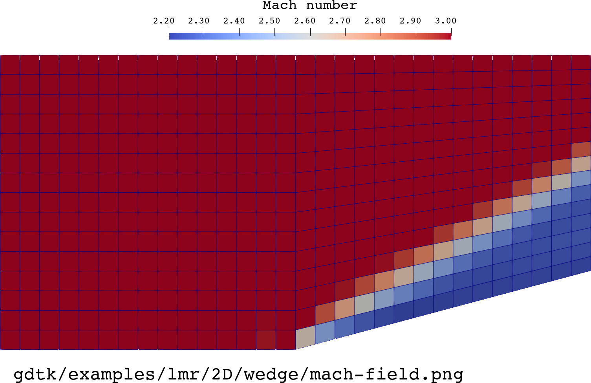

//tag::description[]
= Supersonic flow over a wedge
`gdtk/examples/lmr/2D/wedge`

Kyle A. Damm & Rowan J. Gollan
2023-07-05

This example is of supersonic flow over a wedge: essentially, flow through an oblique shock.
It is test case B.2 "Steady-state Oblique Shock Wave" in the paper by Ghia et al. (2010).
This particular example was set up by Kyle Damm with conditions to match the example in Ghia et al.:
[stem]
++++
M_{\infty} = 3.0; \quad \delta = 15.0^{\circ}; \quad \gamma = 1.4
++++

[TIP]
====
This example shows some advanced grid manipulation:

. How to join `StructuredGrid` grids; and
. How to form an `UnstructuredGrid` from a `StructuredGrid`.
====

//end::description[]

== Reference

  @inproceedings{ghia2010aiaa,
    title={The AIAA code verification project-test cases for CFD code verification},
    author={Ghia, Urmila and Bayyuk, Sami and Habchi, Sami and Roy, Chris and Shih, Tom
      and Conlisk, Terrence and Hirsch, Charles and M. Powers, Joseph},
    booktitle={48th AIAA Aerospace Sciences Meeting Including the New Horizons Forum and Aerospace Exposition},
    number={2010-0125},
    year={2010}
  }

PDF is on Powers' site at:
https://www3.nd.edu/~powers/paper.list/ASM2010VandVatORLANDO.pdf

== Notes

TODO
